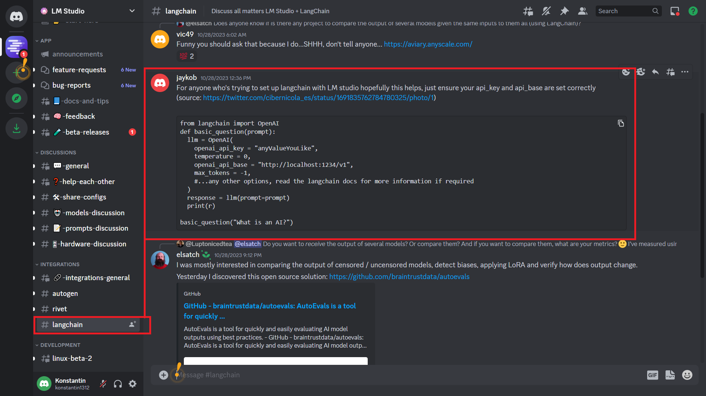
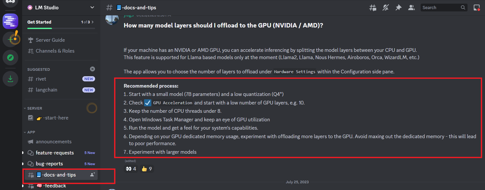

Приглашаю в Телеграм общаться по это теме: https://t.me/AiExp01

# LMRAG_01
RAG: Local LLM vs GPT-4

## RAG (Retrieval-Augmented Generation)

see original picture here: https://docs.aws.amazon.com/sagemaker/latest/dg/jumpstart-foundation-models-customize-rag.html

## Сравниваем: RAG на Local LLM vs GPT-4

| Сервер   | Embeddings | LLM                                              |
|----------| ------- |--------------------------------------------------|
| ChatGPT  | OpenAIEmbeddings   | GPT-4                                            |
| LM Studio| HuggingFaceEmbeddings с моделью 'intfloat/multilingual-e5-large'| IlyaGusev/saiga_mistral_7b_gguf/model-q8_0.gguf  |

***Notes:***
* Подбор Embeddings: https://huggingface.co/spaces/mteb/leaderboard
* Подбор модели: https://huggingface.co/spaces/HuggingFaceH4/open_llm_leaderboard

## LM Studio
В качестве сервера с LLM (Large language model) используется продукт LM Studio: https://lmstudio.ai/

### Скришот про интеграцию LM Studio

### Скришот про настройку LM Studio

### Скришот про размеры моделей и требуемые GPU

### Версия LM Studio под Linux
На текущий момент чтобы найти версию под Linux, нужно к ним на Discord зайти и дать согласие на beta, тогда в чате видна ветка linux-beta-2

Приглашаю в Телеграм общаться по это теме: https://t.me/AiExp01